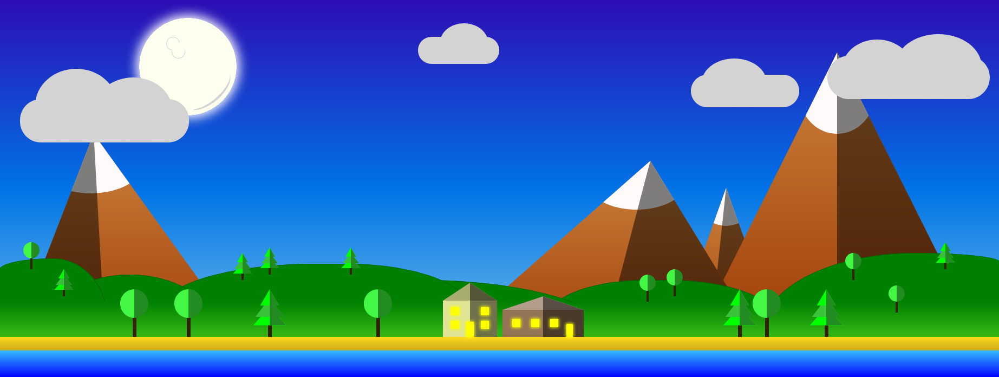

# Moonlit Landscape

## An image made with CSS and HTML only

Here is my attempt to draw a landscape image using only HTML elements stylised by pure CSS.

It was a great experience practising positioning, clip-path, border radii and color gradients.

### Screenshot

### What I learned

- Making curved shapes, especially irregular ones, is much harder than making angular shapes.
- CSS is not a drawing tool, however, with persistence and creativity you can draw just about anything.

### What could be improved

I don't have plans to continue this, but if I did I would add more features to represent vegetation and make the sea and land look more alive. Also I would add animation to make the clouds move and some other new objects like boats move across the screen. More classes to place the location (similar to the trees) of elements could be added to reduce repetition in classes.

### Acknowledgements

The website [html-css-js.com](https://html-css-js.com/css/) was useful generating gradients and colors.

Making shapes with the clip-path property was made easier with [clippy](https://bennettfeely.com/clippy/)
